```
# MongoDB到MySQL数据库迁移 - 设计文档

## 一、需求分析

### 1.1 需求背景

#### 需求号
【dataflow】mongo存储切换为mariadb存储[https://github.com/kweaver-ai/adp/issues/262]

#### 需求来源
技术改进

#### 需求方
内部技术团队

#### 需求场景
Dataflow 工作流自动化系统目前使用 MongoDB 作为数据存储。随着项目开源计划的推进，需要优化系统架构，尽可能减少外部服务依赖，使开源版本具备最小化的服务依赖和更简单的部署环境

#### 用户期望
1. 无缝迁移现有MongoDB数据到MySQL，保证数据完整性和一致性
2. 业务代码改动最小化，保持API接口兼容
3. 提供完整的迁移工具和验证机制

## 二、业务功能设计

### 2.1 概念与术语

| 中文 | 英文 | 定义 |
|------|------|------|
| 工作流系统 | Flow_System | 负责管理和执行DAG工作流的自动化系统 |
| 迁移引擎 | Migration_Engine | 负责执行数据库迁移和模式转换的核心组件 |
| 查询适配器 | Query_Adapter | 将MongoDB BSON查询语法转换为SQL查询的转换器 |
| 有向无环图 | DAG | Directed Acyclic Graph，表示工作流定义的数据结构 |
| DAG实例 | DAG_Instance | 工作流的一次具体执行实例 |
| 任务实例 | Task_Instance | 工作流中单个任务的执行实例 |


### 2.2 业务用例图

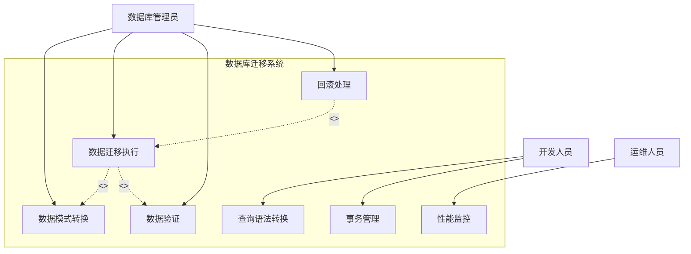

### 2.3 业务功能定义

| 模块 | 功能点 | 业务规则说明 |
|------|--------|-------------|
| 数据模式转换 | MongoDB集合转MySQL表 | 将MongoDB的10个集合转换为对应的MySQL表结构 |
| | 字段名转换 | camelCase/PascalCase → f_snake_case（如userId → f_user_id） |
| | 数据类型映射 | ObjectId → BIGINT UNSIGNED, 嵌套对象 → LONGTEXT(JSON) |
| | 索引创建 | 为主键、外键、高频查询字段创建索引 |
| 查询语法转换 | BSON查询转SQL | 支持$eq, $ne, $gt, $gte, $lt, $lte, $in, $nin等操作符 |
| | 逻辑操作符转换 | $and → AND, $or → OR, $not → NOT |
| | 正则表达式转换 | $regex → LIKE模式匹配 |
| | 复杂查询支持 | 支持嵌套查询、分页、排序、聚合 |
| 数据迁移执行 | 按依赖顺序迁移 | 先迁移主表（t_flow_dag），再迁移关联表 |
| | 批量数据迁移 | 使用批量插入提高迁移效率 |
| | 进度跟踪 | 记录迁移进度和错误日志 |
| | 迁移报告生成 | 生成包含成功/失败统计的报告 |
| 事务支持 | ACID事务 | 支持BEGIN、COMMIT、ROLLBACK操作 |
| | 多表原子操作 | 在同一事务中创建DAG实例和关联记录 |
| | 事务超时处理 | 超时自动回滚 |
| 数据验证 | 数据总数验证 | 验证迁移前后记录数一致 |
| | 字段值验证 | 对比关键字段的数据值 |
| | 外键完整性验证 | 验证关联关系完整性 |
| | JSON结构验证 | 验证JSON字段的结构完整性 |

### 2.4 功能流程图

#### 2.4.1 数据迁移主流程

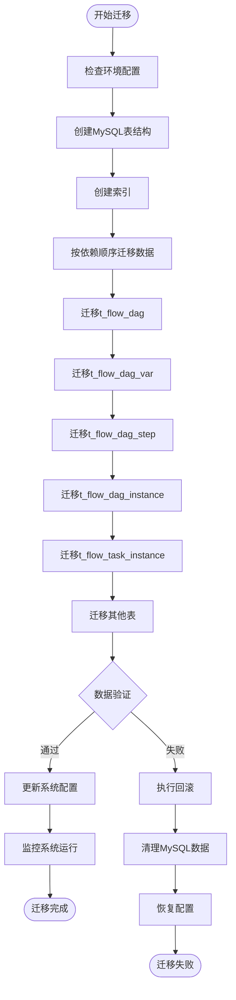

#### 2.4.2 查询转换流程

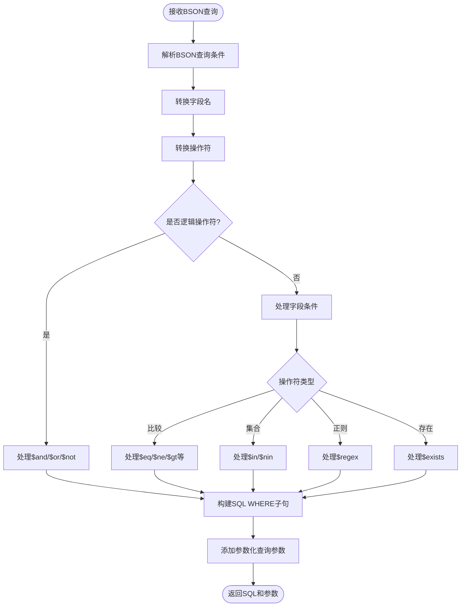

#### 2.4.3 事务处理流程

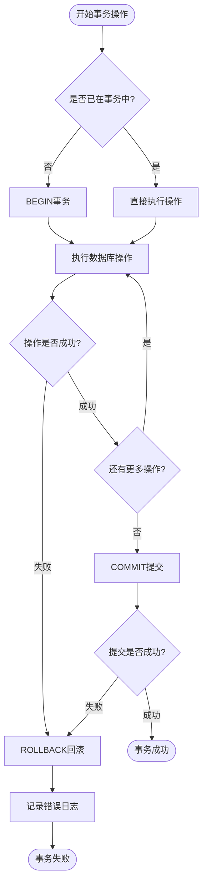

## 三、模块(服务)设计

### 3.1 集成架构设计(Context)

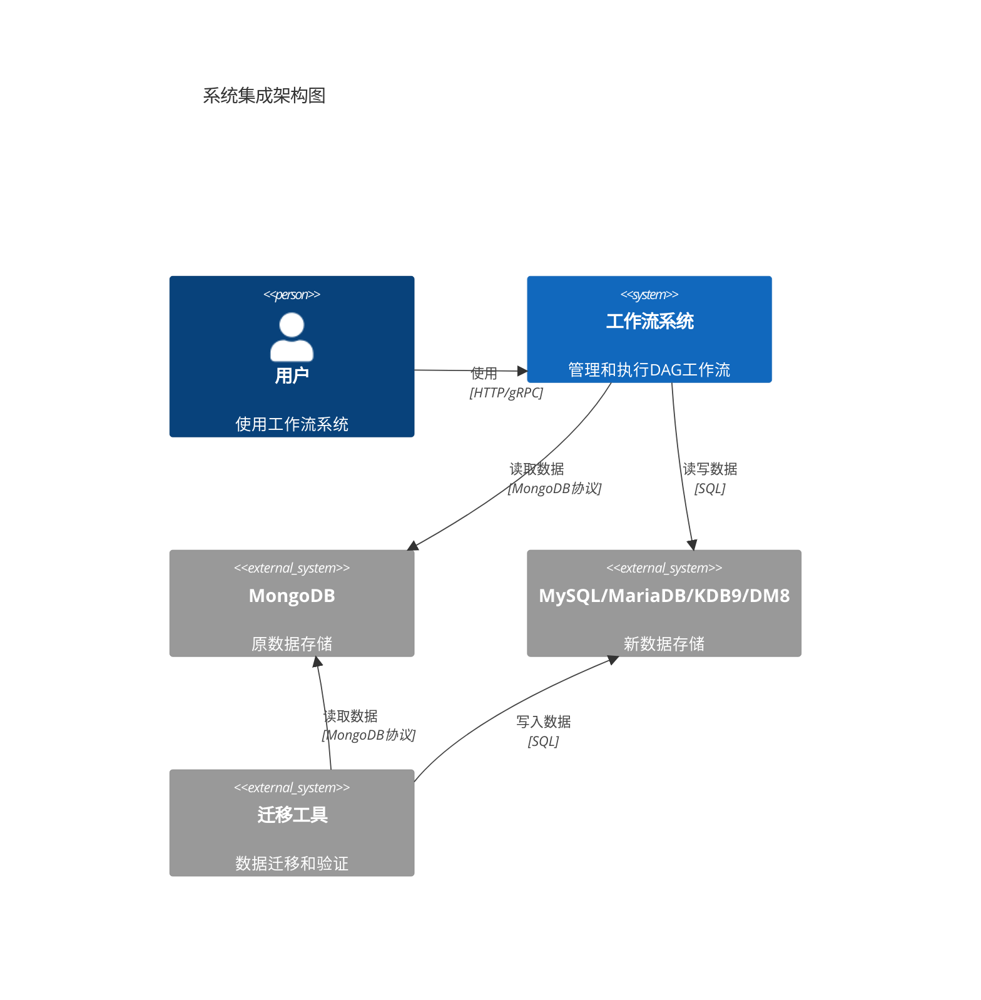

### 3.2 服务架构设计(Container)

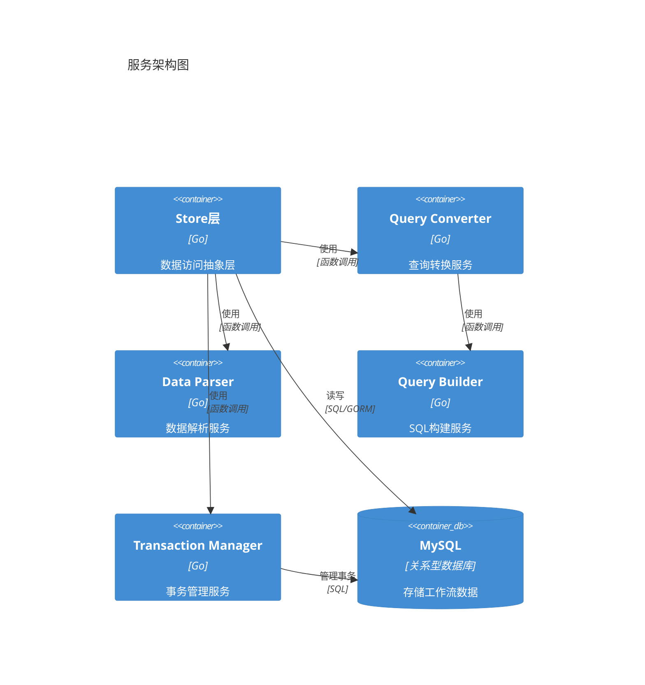

### 3.3 组件设计(Component)

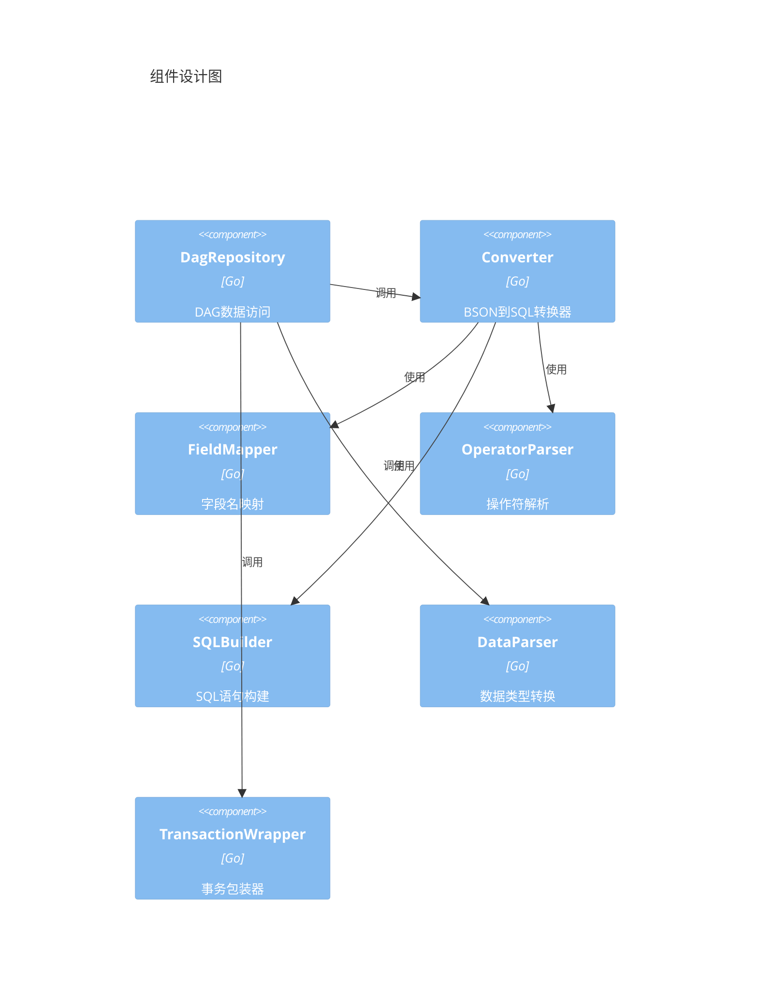

**核心组件说明：**

1. **Converter（查询转换器）**

   - 职责：将MongoDB BSON查询转换为SQL查询
   - 输入：bson.M / map[string]interface{}
   - 输出：SQL字符串 + 参数列表
   - 关键方法：
     - `Convert(query interface{}) (*Result, error)` - 转换完整查询
     - `ConvertConds(query interface{}) (*Result, error)` - 仅转换条件部分
     - `parseCondition()` - 解析查询条件
     - `parseOperator()` - 解析操作符
2. **FieldMapper（字段映射器）**

   - 职责：将MongoDB字段名转换为MySQL字段名
   - 转换规则：camelCase → f_snake_case
   - 示例：userId → f_user_id, createdAt → f_created_at
   - 支持自定义映射表
3. **DataParser（数据解析器）**

   - 职责：在Entity和Model之间转换数据
   - 关键方法：
     - `ToDagModel()` - Entity转Model
     - `ToEntity()` - Model转Entity
     - `copyFields()` - 字段复制和类型转换
   - 支持JSON序列化/反序列化
4. **TransactionWrapper（事务包装器）**

   - 职责：管理数据库事务
   - 关键方法：
     - `WithTransaction()` - 执行事务
     - `Begin()` - 开始事务
     - `Commit()` - 提交事务
     - `Rollback()` - 回滚事务

### 3.4 关键流程设计（Sequence）

#### 3.4.1 查询转换时序图

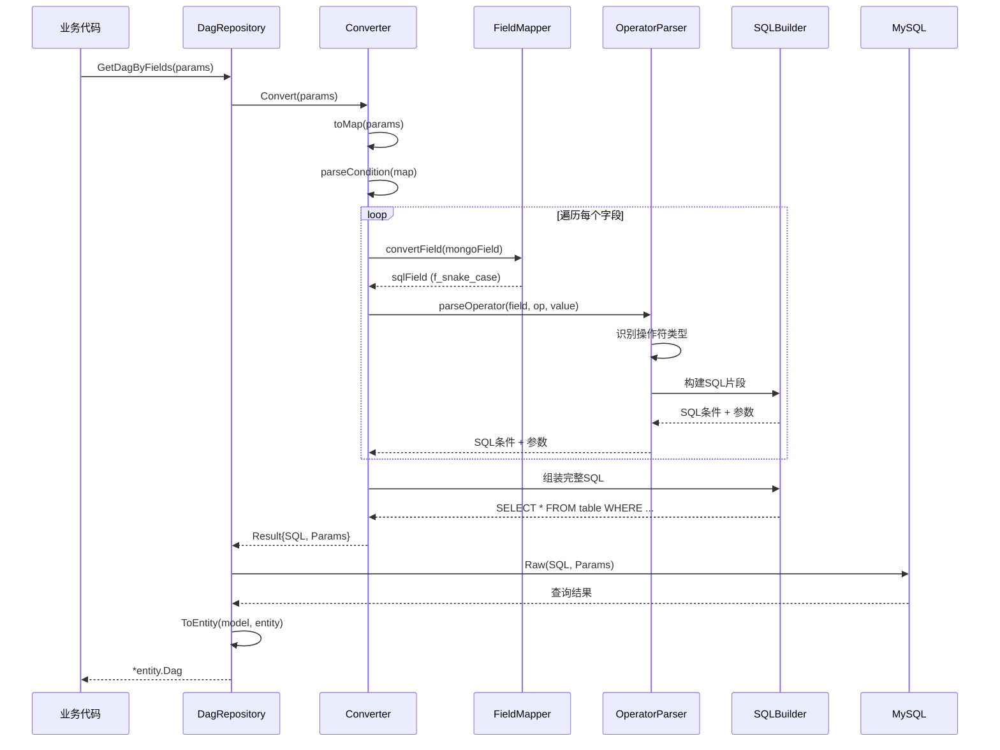

#### 3.4.2 事务处理时序图

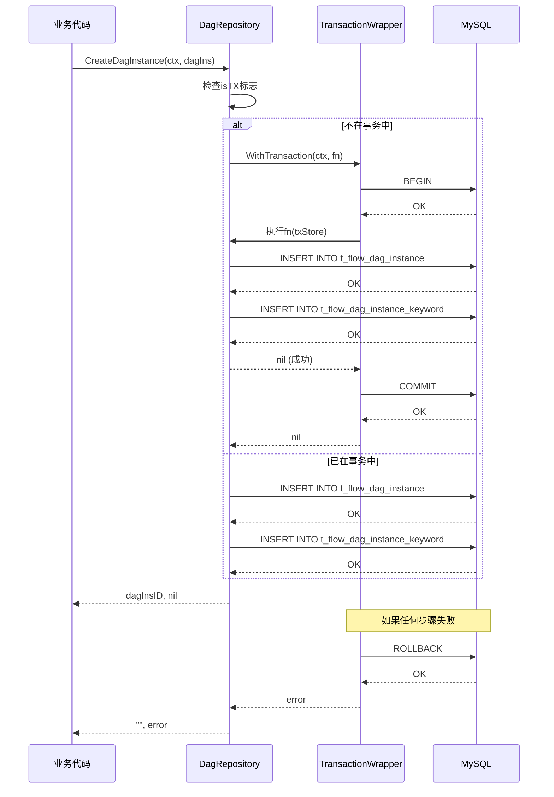

#### 3.4.3 数据迁移时序图

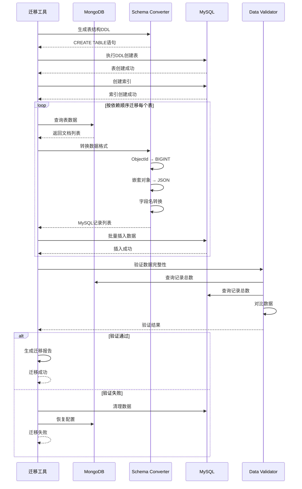

## 四、接口设计

### 4.1 Store接口定义

```go
// Store 数据访问接口
type Store interface {
    // 事务管理
    WithTransaction(ctx context.Context, fn func(context.Context, Store) error) error

    // DAG操作
    CreateDag(ctx context.Context, dag *entity.Dag) (string, error)
    UpdateDag(ctx context.Context, dag *entity.Dag) error
    GetDag(ctx context.Context, dagId string) (*entity.Dag, error)
    GetDagByFields(ctx context.Context, params map[string]interface{}) (*entity.Dag, error)
    DeleteDag(ctx context.Context, id ...string) error
    ListDag(ctx context.Context, input *ListDagInput) ([]*entity.Dag, int64, error)

    // DAG实例操作
    CreateDagInstance(ctx context.Context, dagIns *entity.DagInstance) (string, error)
    UpdateDagInstance(ctx context.Context, dagIns *entity.DagInstance) error
    GetDagInstance(ctx context.Context, dagInsId string) (*entity.DagInstance, error)
    ListDagInstance(ctx context.Context, input *ListDagInstanceInput) ([]*entity.DagInstance, int64, error)

    // 任务实例操作
    CreateTaskInstance(ctx context.Context, taskIns *entity.TaskInstance) (string, error)
    UpdateTaskInstance(ctx context.Context, taskIns *entity.TaskInstance) error
    GetTaskInstance(ctx context.Context, taskInsId string) (*entity.TaskInstance, error)

    // 批量操作
    BatchCreateDagInstance(ctx context.Context, dagInsList []*entity.DagInstance) error
    BatchUpdateTaskInstance(ctx context.Context, taskInsList []*entity.TaskInstance) error
}
```

### 4.2 查询转换器接口

```go
// Converter BSON查询转SQL转换器
type Converter struct {
    tableName   string
    fieldMap    map[string]string
    autoConvert bool
}

// Result 转换结果
type Result struct {
    SQL    string          // 完整SQL语句
    Conds  string          // WHERE条件部分
    Params []interface{}   // 参数化查询参数
}

// Convert 转换完整查询（包含SELECT）
func (c *Converter) Convert(query interface{}) (*Result, error)

// ConvertConds 仅转换条件部分
func (c *Converter) ConvertConds(query interface{}) (*Result, error)
```

### 4.3 查询输入参数定义

```go
// ListDagInput DAG列表查询参数
type ListDagInput struct {
    UserID         string                 // 用户ID
    Accessors      []string               // 访问者列表
    Scope          string                 // 查询范围：all/user
    Filter         map[string]interface{} // BSON过滤条件
    Sort           map[string]int         // 排序：1升序，-1降序
    Limit          int64                  // 分页大小
    Offset         int64                  // 偏移量
    ProjectFields  []string               // 投影字段
}

// ListDagInstanceInput DAG实例列表查询参数
type ListDagInstanceInput struct {
    DagID          string                 // DAG ID
    UserID         string                 // 用户ID
    Status         []string               // 状态列表
    Filter         map[string]interface{} // BSON过滤条件
    Sort           map[string]int         // 排序
    Limit          int64                  // 分页大小
    Offset         int64                  // 偏移量
}
```

### 4.4 配置管理接口

```go
// DatabaseConfig 数据库配置
type DatabaseConfig struct {
    Type          string // 数据库类型：mysql/mariadb/kdb9/dm8
    Host          string // 主机地址
    Port          int    // 端口
    Database      string // 数据库名
    Username      string // 用户名
    Password      string // 密码
    MaxOpenConns  int    // 最大连接数
    MaxIdleConns  int    // 最大空闲连接数
    ConnMaxLife   int    // 连接最大生命周期（秒）
}

// MigrationConfig 迁移配置
type MigrationConfig struct {
    SourceMongo   MongoConfig    // 源MongoDB配置
    TargetMySQL   DatabaseConfig // 目标MySQL配置
    BatchSize     int            // 批量迁移大小
    Timeout       int            // 超时时间（秒）
    EnableValidate bool          // 是否启用验证
    AutoRollback  bool           // 是否自动回滚
}
```

## 五、数据库设计

### 5.1 表结构定义

#### 5.1.1 t_flow_dag（工作流定义表）

| 字段名 | 类型 | 约束 | 说明 |
|--------|------|------|------|
| f_id | BIGINT UNSIGNED | PRIMARY KEY | 主键ID |
| f_created_at | BIGINT | NOT NULL | 创建时间（Unix时间戳） |
| f_updated_at | BIGINT | NOT NULL | 更新时间（Unix时间戳） |
| f_user_id | VARCHAR(255) | NOT NULL, INDEX | 用户ID |
| f_name | VARCHAR(255) | NOT NULL, INDEX | 工作流名称 |
| f_desc | LONGTEXT | | 描述 |
| f_trigger | LONGTEXT | | 触发器配置（JSON） |
| f_cron | VARCHAR(255) | | Cron表达式 |
| f_vars | LONGTEXT | | 变量定义（JSON） |
| f_status | VARCHAR(50) | NOT NULL | 状态 |
| f_tasks | LONGTEXT | | 任务列表（JSON） |
| f_steps | LONGTEXT | | 步骤列表（JSON） |
| f_description | LONGTEXT | | 详细描述 |
| f_shortcuts | LONGTEXT | | 快捷方式（JSON） |
| f_accessors | LONGTEXT | | 访问者列表（JSON） |
| f_type | VARCHAR(50) | NOT NULL, INDEX | 类型 |
| f_policy_type | VARCHAR(50) | | 策略类型 |
| f_appinfo | LONGTEXT | | 应用信息（JSON） |
| f_priority | VARCHAR(50) | | 优先级 |
| f_removed | BOOLEAN | DEFAULT FALSE | 是否删除 |
| f_emails | LONGTEXT | | 邮件列表（JSON） |
| f_template | VARCHAR(255) | | 模板 |
| f_published | BOOLEAN | DEFAULT FALSE | 是否发布 |
| f_trigger_config | LONGTEXT | | 触发器配置（JSON） |
| f_sub_ids | LONGTEXT | | 子流程ID列表（JSON） |
| f_exec_mode | VARCHAR(50) | | 执行模式 |
| f_category | VARCHAR(255) | | 分类 |
| f_outputs | LONGTEXT | | 输出定义（JSON） |
| f_instructions | LONGTEXT | | 指令（JSON） |
| f_operator_id | VARCHAR(255) | | 操作者ID |
| f_inc_values | LONGTEXT | | 增量值（JSON） |
| f_version | LONGTEXT | | 版本信息（JSON） |
| f_version_id | VARCHAR(255) | | 版本ID |
| f_modify_by | VARCHAR(255) | | 修改者 |
| f_is_debug | BOOLEAN | DEFAULT FALSE | 是否调试模式 |
| f_debug_id | VARCHAR(255) | | 调试ID |
| f_biz_domain_id | VARCHAR(255) | | 业务域ID |

**索引：**

- PRIMARY KEY (f_id)
- INDEX idx_user_id (f_user_id)
- INDEX idx_type (f_type)
- INDEX idx_name (f_name)

#### 5.1.2 t_flow_dag_instance（工作流实例表）

| 字段名 | 类型 | 约束 | 说明 |
|--------|------|------|------|
| f_id | BIGINT UNSIGNED | PRIMARY KEY | 主键ID |
| f_created_at | BIGINT | NOT NULL | 创建时间 |
| f_updated_at | BIGINT | NOT NULL, INDEX | 更新时间 |
| f_dag_id | BIGINT UNSIGNED | NOT NULL, INDEX | DAG ID（外键） |
| f_trigger | VARCHAR(255) | | 触发方式 |
| f_worker | VARCHAR(255) | INDEX | 执行节点 |
| f_source | VARCHAR(255) | | 来源 |
| f_vars | LONGTEXT | | 变量（JSON） |
| f_keywords | LONGTEXT | | 关键词（JSON） |
| f_event_persistence | INT | | 事件持久化 |
| f_event_oss_path | VARCHAR(500) | | 事件OSS路径 |
| f_share_data | LONGTEXT | | 共享数据（JSON） |
| f_share_data_ext | LONGTEXT | | 共享数据扩展（JSON） |
| f_status | VARCHAR(50) | NOT NULL, INDEX | 状态 |
| f_reason | TEXT | | 失败原因 |
| f_cmd | LONGTEXT | | 命令（JSON） |
| f_has_cmd | BOOLEAN | DEFAULT FALSE | 是否有命令 |
| f_batch_run_id | VARCHAR(255) | INDEX | 批次运行ID |
| f_user_id | VARCHAR(255) | NOT NULL, INDEX | 用户ID |
| f_ended_at | BIGINT | | 结束时间 |
| f_dag_type | VARCHAR(50) | | DAG类型 |
| f_policy_type | VARCHAR(50) | | 策略类型 |
| f_appinfo | LONGTEXT | | 应用信息（JSON） |
| f_priority | VARCHAR(50) | | 优先级 |
| f_mode | INT | | 模式 |
| f_dump | TEXT | | 转储信息 |
| f_dump_ext | LONGTEXT | | 转储扩展（JSON） |
| f_success_callback | VARCHAR(500) | | 成功回调 |
| f_error_callback | VARCHAR(500) | | 错误回调 |
| f_call_chain | LONGTEXT | | 调用链（JSON） |
| f_resume_data | TEXT | | 恢复数据 |
| f_resume_status | VARCHAR(50) | | 恢复状态 |
| f_version | LONGTEXT | | 版本（JSON） |
| f_version_id | VARCHAR(255) | | 版本ID |
| f_biz_domain_id | VARCHAR(255) | | 业务域ID |

**索引：**

- PRIMARY KEY (f_id)
- INDEX idx_dag_id (f_dag_id)
- INDEX idx_user_id (f_user_id)
- INDEX idx_batch_run_id (f_batch_run_id)
- INDEX idx_worker (f_worker)
- INDEX idx_status (f_status)
- INDEX idx_updated_at (f_updated_at)
- INDEX idx_composite (f_id, f_status, f_updated_at)

#### 5.1.3 t_flow_task_instance（任务实例表）

| 字段名 | 类型 | 约束 | 说明 |
|--------|------|------|------|
| f_id | BIGINT UNSIGNED | PRIMARY KEY | 主键ID |
| f_created_at | BIGINT | NOT NULL | 创建时间 |
| f_updated_at | BIGINT | NOT NULL | 更新时间 |
| f_task_id | VARCHAR(255) | NOT NULL | 任务ID |
| f_dag_ins_id | BIGINT UNSIGNED | NOT NULL, INDEX | DAG实例ID（外键） |
| f_name | VARCHAR(255) | | 任务名称 |
| f_depend_on | LONGTEXT | | 依赖关系（JSON） |
| f_action_name | VARCHAR(255) | INDEX | 动作名称 |
| f_timeout_secs | INT | | 超时时间（秒） |
| f_params | LONGTEXT | | 参数（JSON） |
| f_traces | LONGTEXT | | 追踪信息（JSON） |
| f_status | VARCHAR(50) | NOT NULL | 状态 |
| f_reason | TEXT | | 失败原因 |
| f_pre_checks | LONGTEXT | | 前置检查（JSON） |
| f_results | LONGTEXT | | 结果（JSON） |
| f_steps | LONGTEXT | | 步骤（JSON） |
| f_last_modified_at | BIGINT | | 最后修改时间 |
| f_rendered_params | LONGTEXT | | 渲染后参数（JSON） |
| f_hash | VARCHAR(255) | INDEX | 哈希值 |
| f_settings | LONGTEXT | | 设置（JSON） |
| f_metadata | LONGTEXT | | 元数据（JSON） |

**索引：**

- PRIMARY KEY (f_id)
- INDEX idx_dag_ins_id (f_dag_ins_id)
- INDEX idx_hash (f_hash)
- INDEX idx_action_name (f_action_name)

#### 5.1.4 t_flow_dag_var（DAG变量表）

| 字段名 | 类型 | 约束 | 说明 |
|--------|------|------|------|
| f_id | BIGINT UNSIGNED | PRIMARY KEY AUTO_INCREMENT | 主键ID |
| f_dag_id | BIGINT UNSIGNED | NOT NULL, INDEX | DAG ID（外键） |
| f_var_name | VARCHAR(255) | NOT NULL | 变量名 |
| f_default_value | TEXT | | 默认值 |
| f_var_type | VARCHAR(50) | | 变量类型 |
| f_description | VARCHAR(500) | | 描述 |

**索引：**

- PRIMARY KEY (f_id)
- INDEX idx_dag_id (f_dag_id)

#### 5.1.5 其他辅助表

**t_flow_dag_version（DAG版本表）**

- f_id (BIGINT UNSIGNED, PRIMARY KEY)
- f_created_at (BIGINT)
- f_updated_at (BIGINT)
- f_dag_id (VARCHAR(255), INDEX)
- f_user_id (VARCHAR(255))
- f_version (VARCHAR(50))
- f_version_id (VARCHAR(255), INDEX)
- f_change_log (TEXT)
- f_config (LONGTEXT) - 完整DAG配置JSON
- f_sort_time (BIGINT)

**t_flow_dag_step（DAG步骤索引表）**

- f_id (BIGINT UNSIGNED, PRIMARY KEY)
- f_dag_id (BIGINT UNSIGNED, INDEX)
- f_operator (VARCHAR(255), INDEX)
- f_source_id (VARCHAR(255))
- f_has_datasource (BOOLEAN)

**t_flow_dag_accessor（DAG访问者表）**

- f_id (BIGINT UNSIGNED, PRIMARY KEY)
- f_dag_id (BIGINT UNSIGNED, INDEX)
- f_accessor_id (VARCHAR(255), INDEX)

**t_flow_dag_instance_keyword（实例关键词表）**

- f_id (BIGINT UNSIGNED, PRIMARY KEY)
- f_dag_ins_id (BIGINT UNSIGNED, INDEX)
- f_keyword (VARCHAR(255), INDEX)

**t_flow_outbox（出站消息表）**

- f_id (BIGINT UNSIGNED, PRIMARY KEY)
- f_created_at (BIGINT)
- f_updated_at (BIGINT)
- f_msg (LONGTEXT)
- f_topic (VARCHAR(255))

**t_flow_inbox（入站消息表）**

- f_id (BIGINT UNSIGNED, PRIMARY KEY)
- f_created_at (BIGINT)
- f_updated_at (BIGINT)
- f_msg (LONGTEXT)
- f_topic (VARCHAR(255))
- f_docid (VARCHAR(255))
- f_dag (LONGTEXT)

### 5.2 字段命名规范

**转换规则：**

1. MongoDB字段名（camelCase/PascalCase）→ MySQL字段名（f_snake_case）
2. 所有字段名添加 `f_` 前缀
3. 驼峰命名转下划线分隔

**转换示例：**

- `_id` → `f_id`
- `userId` → `f_user_id`
- `createdAt` → `f_created_at`
- `batchRunID` → `f_batch_run_id`
- `HTMLParser` → `f_html_parser`
- `dagInsID` → `f_dag_ins_id`

**实现代码：**

```go
func camelToFSnake(s string) string {
    if strings.HasPrefix(s, "f_") {
        return s
    }
    s = strings.TrimLeft(s, "_")
    var result strings.Builder
    runes := []rune(s)
    for i, r := range runes {
        if unicode.IsUpper(r) {
            if i > 0 {
                prevIsUpper := unicode.IsUpper(runes[i-1])
                nextIsLower := i+1 < len(runes) && unicode.IsLower(runes[i+1])
                if !prevIsUpper || nextIsLower {
                    result.WriteRune('_')
                }
            }
            result.WriteRune(unicode.ToLower(r))
        } else {
            result.WriteRune(r)
        }
    }
    return "f_" + result.String()
}
```

### 5.3 数据类型映射规则

| MongoDB类型 | MySQL类型 | 说明 |
|------------|-----------|------|
| ObjectId | BIGINT UNSIGNED | 转换为数值ID |
| String (短) | VARCHAR(255) | 长度<255的字符串 |
| String (长) | TEXT / LONGTEXT | 长度>=255的字符串 |
| Number (整数) | INT / BIGINT | 根据范围选择 |
| Number (浮点) | DOUBLE | 浮点数 |
| Boolean | BOOLEAN / TINYINT(1) | 布尔值 |
| Date | BIGINT | Unix时间戳（毫秒） |
| Array | LONGTEXT | JSON格式存储 |
| Object (嵌套) | LONGTEXT | JSON格式存储 |
| Binary | BLOB | 二进制数据 |
| Null | NULL | 空值 |

**JSON字段处理：**

- 所有嵌套对象和数组统一使用LONGTEXT类型存储JSON字符串
- 使用Go的json.Marshal/Unmarshal进行序列化/反序列化
- 支持MySQL的JSON函数查询（JSON_EXTRACT等）

**时间戳处理：**

- MongoDB的Date类型转换为Unix时间戳（毫秒）
- 存储为BIGINT类型
- 便于范围查询和排序

### 5.4 索引设计

**索引设计原则：**

1. 为所有主键创建PRIMARY KEY索引
2. 为外键字段创建普通索引
3. 为高频查询字段创建索引
4. 为组合查询创建复合索引
5. 避免创建冗余索引

**关键索引列表：**

**t_flow_dag表：**

- PRIMARY KEY (f_id)
- INDEX idx_user_id (f_user_id) - 按用户查询
- INDEX idx_type (f_type) - 按类型查询
- INDEX idx_name (f_name) - 按名称查询

**t_flow_dag_instance表：**

- PRIMARY KEY (f_id)
- INDEX idx_dag_id (f_dag_id) - 按DAG查询实例
- INDEX idx_user_id (f_user_id) - 按用户查询
- INDEX idx_batch_run_id (f_batch_run_id) - 批次查询
- INDEX idx_worker (f_worker) - 按执行节点查询
- INDEX idx_status (f_status) - 按状态查询
- INDEX idx_updated_at (f_updated_at) - 按更新时间排序
- INDEX idx_composite (f_id, f_status, f_updated_at) - 复合索引优化分页查询

**t_flow_task_instance表：**

- PRIMARY KEY (f_id)
- INDEX idx_dag_ins_id (f_dag_ins_id) - 按DAG实例查询任务
- INDEX idx_hash (f_hash) - 按哈希值查询
- INDEX idx_action_name (f_action_name) - 按动作名称查询

**t_flow_dag_step表：**

- PRIMARY KEY (f_id)
- INDEX idx_dag_id (f_dag_id) - 按DAG查询步骤
- INDEX idx_operator (f_operator) - 按操作符查询

**t_flow_dag_instance_keyword表：**

- PRIMARY KEY (f_id)
- INDEX idx_dag_ins_id (f_dag_ins_id) - 按实例查询关键词
- INDEX idx_keyword (f_keyword) - 按关键词搜索

## 六、质量目标

### 6.1 可靠性

| 目标 | 指标 |
|------|------|
| 数据不丢失 | 迁移后数据总数与MongoDB一致，误差率0% |
| 事务ACID | 所有事务操作满足原子性、一致性、隔离性、持久性 |
| 故障恢复 | 支持自动回滚，迁移失败后可恢复到原始状态 |
| 连接可靠性 | 数据库连接断开时自动重连，最多重试3次 |
| 数据一致性 | 外键关联关系完整性100% |

### 6.2 性能

| 场景 | 配置 | 目标 |
|------|------|------|
| 列表查询 | 数据量<10000条 | 响应时间 ≤ 500ms |
| 单条查询 | 按主键查询 | 响应时间 ≤ 50ms |
| 创建DAG实例 | 单条插入 | 响应时间 ≤ 200ms |
| 批量创建实例 | 100条批量插入 | 响应时间 ≤ 2s |
| 复杂查询 | 多条件+排序+分页 | 响应时间 ≤ 1s |
| 数据迁移 | 10万条记录 | 迁移时间 ≤ 10分钟 |
| 并发查询 | 100并发 | TPS ≥ 200 |

### 6.3 兼容性

**数据库兼容性：**

- MySQL 5.7+
- MariaDB 10.3+
- KDB9（人大金仓）
- DM8（达梦数据库）

**系统架构：**

- x86_64
- ARM64

**操作系统：**

- Linux (CentOS 7+, Ubuntu 18.04+)
- Windows Server 2016+

**编程语言：**

- Go 1.24+

### 6.4 安全性

| 维度 | 要求 |
|------|------|
| SQL注入防护 | 100%使用参数化查询，禁止字符串拼接SQL |
| 密码存储 | 数据库密码加密存储，不得明文记录 |
| 权限管理 | 使用最小权限原则，应用账号仅授予必要权限 |
| 审计日志 | 记录所有数据库操作的审计日志，包含用户、时间、操作类型 |
| 数据传输 | 支持SSL/TLS加密连接 |
| 敏感数据 | 迁移日志中不输出敏感数据（密码、密钥等） |

### 6.5 可观测性

**日志规范：**

- 程序日志记录完整，包含关键操作的输入输出
- 错误日志包含完整堆栈信息
- 日志级别：DEBUG、INFO、WARN、ERROR
- 日志格式：结构化JSON格式


**链路跟踪：**

- 支持OpenTelemetry链路跟踪
- 记录每个数据库操作的Span
- 包含SQL语句、参数、执行时间

### 6.6 可扩展性

| 维度 | 支持方式 |
|------|---------|
| 新增操作符 | 在Converter中添加新的parseOperator分支 |
| 新增数据库类型 | 实现数据库方言适配器接口 |
| 新增表结构 | 定义Model结构体和转换函数 |
| 自定义字段映射 | 通过WithFieldMap选项配置 |

## 七、部署&升级设计

### 7.1 部署架构

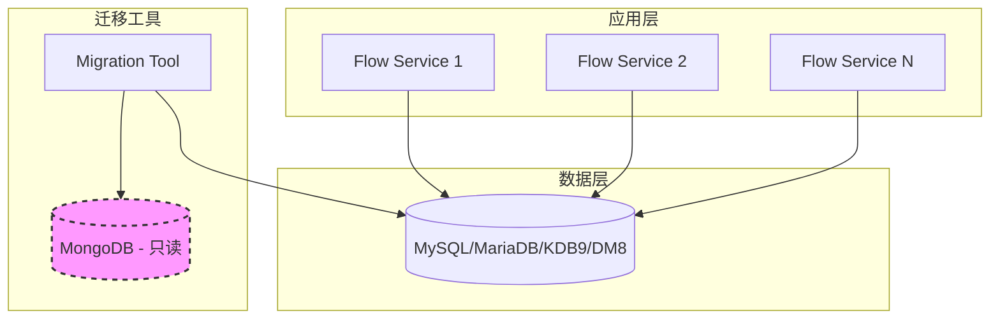

### 7.2 部署交付物

**应用程序：**

- dataflow:   服务包

**迁移工具：**

- 02-mongodb_to_mysql_migration.py 迁移脚本
- DDL脚本：01-add-table-and-data.sql
- 迁移配置：migration-config.yaml

**文档：**

- 部署指南
- 迁移操作手册
- 故障排查手册

### 7.3 配置文件

**config.yaml（应用配置）**

```yaml
depservices:
  rds:
    source_type: internal
    type: MariaDB
    host: mariadb-mariadb-master .resource.svc.cluster.local.
    port: 3330
    user: anyshare
    password: eisoo.com123
    hostRead: mariadb-mariadb-cluster.resource.svc.cluster.local
    portRead: 3330
    admin_key:"cm9vdDplaXNvby5jb20xMiM="
    mgmt host: mariadb-mgmt-cluster.resource.svc.cluster.local.
    mgmt_port; 8888
    system id:
  mongodb :
    admin_key: cm9vdDplaXNvby5jb20xMjM=
    db: automation
    deployTrait:
    version: ..
    host: mongodb-mongodb-0.mongodb-mongodb.resource.svc.cluster.local.
    mgmt_host: mongodb-mgmt-cluster.resource.svc.cluster.local.mgmt_port: 30281
    options:
        auth source: anyshare
        authSource: anyshare
    password: eisoo.com123
    port: 28000
    replicaSet: rsosource_type: internal
    ssl: false
    user: anyshare
```


## 八、评审记录

评审：待评审

| 评审人 | 点评 | 评审结论 | 评审时间 |
|--------|------|---------|---------|
| | | | |
| | | | |
| | | | |

---

## 附录

### A. MongoDB操作符支持列表

| 操作符 | SQL转换 | 支持状态 |
|--------|---------|---------|
| $eq | = | ✓ |
| $ne | != | ✓ |
| $gt | > | ✓ |
| $gte | >= | ✓ |
| $lt | < | ✓ |
| $lte | <= | ✓ |
| $in | IN | ✓ |
| $nin | NOT IN | ✓ |
| $and | AND | ✓ |
| $or | OR | ✓ |
| $not | NOT | ✓ |
| $nor | NOT (... OR ...) | ✓ |
| $exists | IS NULL / IS NOT NULL | ✓ |
| $regex | LIKE | ✓ |
| $mod | % = | ✓ |
| $size | JSON_LENGTH | ✓ |
| $elemMatch | JSON查询 | 部分支持 |

### B. 字段名转换示例

| MongoDB字段名 | MySQL字段名 | 说明 |
|--------------|-------------|------|
| _id | f_id | 去除下划线前缀 |
| id | f_id | 直接添加前缀 |
| name | f_name | 简单字段 |
| userId | f_user_id | 驼峰转下划线 |
| createdAt | f_created_at | 驼峰转下划线 |
| batchRunID | f_batch_run_id | 连续大写处理 |
| HTMLParser | f_html_parser | 连续大写处理 |
| myHTTPServer | f_my_http_server | 连续大写处理 |
| user_name | f_user_name | 已有下划线保持 |
| f_existing | f_existing | 已有f_前缀不重复 |

### C. 数据迁移依赖顺序

```
1. t_flow_dag (主表)
   ├── 2. t_flow_dag_var (依赖dag_id)
   ├── 3. t_flow_dag_step (依赖dag_id)
   ├── 4. t_flow_dag_accessor (依赖dag_id)
   └── 5. t_flow_dag_version (依赖dag_id)

6. t_flow_dag_instance (依赖dag_id)
   └── 7. t_flow_dag_instance_keyword (依赖dag_ins_id)

8. t_flow_task_instance (依赖dag_ins_id)

9. t_flow_outbox (独立表)
10. t_flow_inbox (独立表)
```

### D. 参考文档

- [GORM文档](https://gorm.io/docs/)
- [MongoDB查询操作符](https://docs.mongodb.com/manual/reference/operator/query/)

```

```
