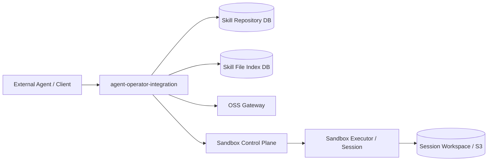
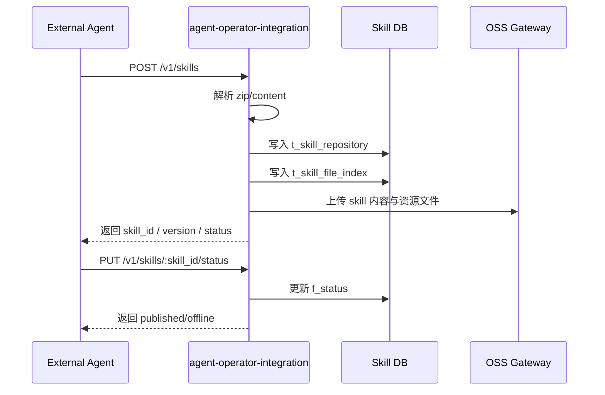
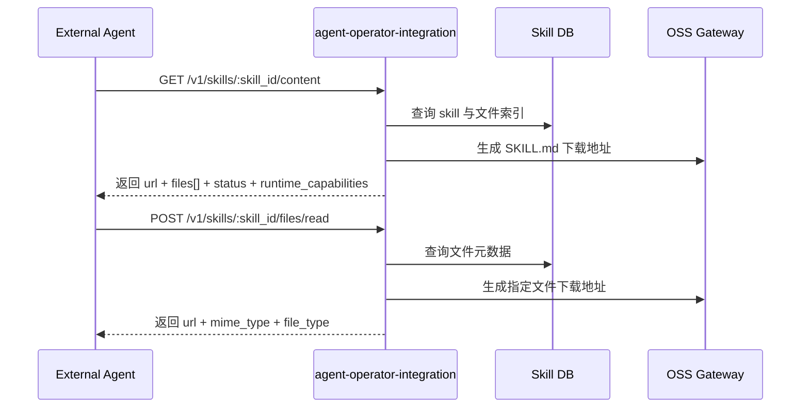
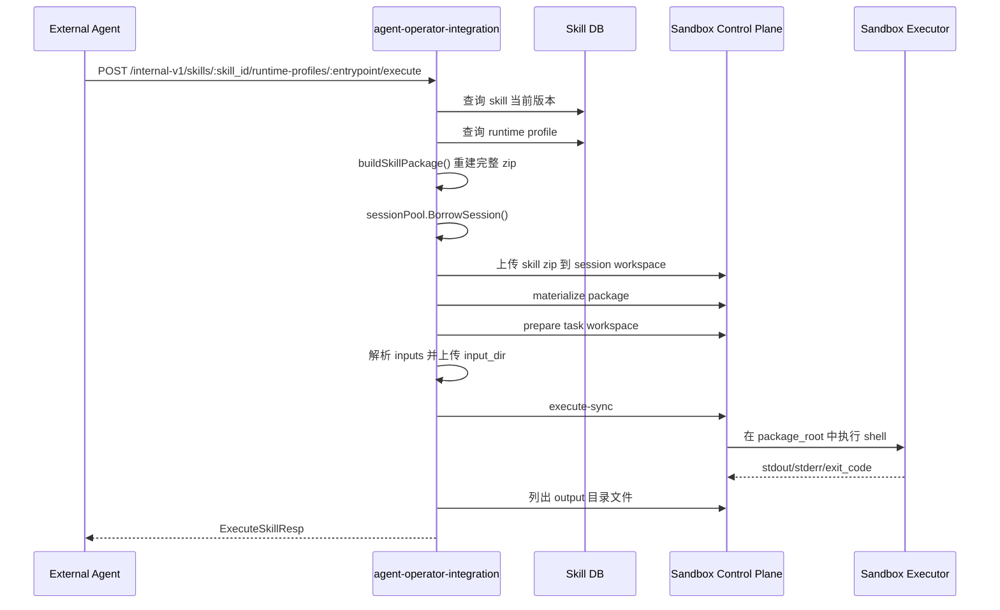

# Skill API 集成与调用流程

## 文档范围

本文档只回答两个问题：

1. 当前 `agent-operator-integration` 和 `sandbox` 之间的真实调用链是什么
2. 外部 Agent 如果要使用 Skill 的渐进式加载与脚本执行能力，应该如何调用接口

不在本文档展开的内容：

- `skill.runtime.yaml` 的目标格式与长期设计
- Runtime Profile 的演进方案

这些内容单独见：

- [skill_runtime_yaml_design.md](/Users/chenshu/Code/github.com/kweaver-ai/adp/execution-factory/operator-integration/docs/design/features/skill_runtime_yaml_design.md)
- [skill_runtime_profile_execution_minimal.md](/Users/chenshu/Code/github.com/kweaver-ai/adp/execution-factory/operator-integration/docs/design/features/skill_runtime_profile_execution_minimal.md)

## 1. 服务边界

### 1.1 agent-operator-integration

职责：

- Skill 注册、查询、状态管理
- Skill 内容和资源文件的渐进式读取
- Skill Runtime Profile 管理
- Skill 执行编排
- 通过 HTTP 调用 sandbox

API 根路径：

- 公共 API：`/api/agent-operator-integration/v1`
- 内部 API：`/api/agent-operator-integration/internal-v1`

### 1.2 sandbox

职责：

- 创建和管理 session
- 提供 session workspace 文件操作
- 执行代码
- 提供 package materialize 和 task workspace prepare 原语

API 根路径：

- 公共控制面：`/api/v1`
- 内部控制面：`/api/v1/internal`

## 2. 当前 Skill 相关接口

### 2.1 公共 Skill API

基于 `/api/agent-operator-integration/v1`

- `POST /skills`
- `GET /skills`
- `GET /skills/:skill_id`
- `GET /skills/:skill_id/download`
- `DELETE /skills/:skill_id`
- `PUT /skills/:skill_id/status`
- `GET /skills/:skill_id/content`
- `POST /skills/:skill_id/files/read`
- `GET /skills/market`
- `GET /skills/market/:skill_id`

### 2.2 内部 Runtime / Execute API

基于 `/api/agent-operator-integration/internal-v1`

- `GET /skills/:skill_id/runtime-profiles/:entrypoint`
- `POST /skills/:skill_id/runtime-profiles/:entrypoint`
- `POST /skills/:skill_id/runtime-profiles/:entrypoint/execute`

结论：

- Skill 注册、发布、读取走公共 API
- Runtime Profile 管理和脚本执行走内部 API

## 3. 当前总链路



## 4. 当前真实调用流程

### 4.1 Skill 注册与发布



### 4.2 Skill 渐进式读取



### 4.3 Skill 脚本执行



## 5. 外部 Agent 的调用步骤

### 5.1 如果 Agent 负责创建并使用 Skill

1. `POST /api/agent-operator-integration/v1/skills`
2. `PUT /api/agent-operator-integration/v1/skills/:skill_id/status`
3. `GET /api/agent-operator-integration/v1/skills/:skill_id/content`
4. `POST /api/agent-operator-integration/v1/skills/:skill_id/files/read`
5. `POST /api/agent-operator-integration/internal-v1/skills/:skill_id/runtime-profiles/:entrypoint/execute`

### 5.2 如果 Agent 只负责使用现有 Skill

1. `GET /api/agent-operator-integration/v1/skills/:skill_id/content`
2. `POST /api/agent-operator-integration/v1/skills/:skill_id/files/read`
3. `POST /api/agent-operator-integration/internal-v1/skills/:skill_id/runtime-profiles/:entrypoint/execute`

## 6. 三个关键接口

如果只看“Skill 渐进式加载 + 脚本执行”的最小能力，外部 Agent 当前确实主要依赖这三个接口：

- 读取 `SKILL.md`：`GET /v1/skills/:skill_id/content`
- 读取 Skill 资源文件：`POST /v1/skills/:skill_id/files/read`
- 执行 Skill 脚本：`POST /internal-v1/skills/:skill_id/runtime-profiles/:entrypoint/execute`

但是第三个接口有一个前提：

- 对应 `entrypoint` 的 runtime profile 已存在

当前实现里，这个 profile 有两种来源：

- zip 注册时如果根目录存在 `skill.runtime.yaml`，平台会自动解析并写入 runtime profile
- 也可以通过内部接口 `POST /internal-v1/skills/:skill_id/runtime-profiles/:entrypoint` 手工写入

## 6.1 当前状态可见性与可执行性规则

针对 runtime profile 的 `published / unpublish / offline`，当前实现规则是：

- public `GET /v1/skills/:skill_id/content`
  - `runtime_capabilities` 只返回 `published`
- internal `GET /v1/skills/:skill_id/content`
  - `runtime_capabilities` 返回 `published + unpublish`
  - `offline` 会被隐藏
- `POST /internal-v1/skills/:skill_id/runtime-profiles/:entrypoint/execute`
  - `offline` 会被拒绝执行
  - `published + unpublish` 允许进入执行链

也就是说，当前 internal 读取侧和 internal 执行侧的状态门禁是一致的：

- internal 可见的 runtime capability，原则上也是当前可执行的
- 唯一被显式屏蔽的是 `offline`

## 7. 当前输入方式

执行接口当前最小支持的输入类型：

- 普通字符串
- `text`
- `path`
- `inline_file`
- `inline_file_base64`
- `artifact_ref`
- `resource_ref`
- `oss_object`

### 7.1 直接传已有路径

```json
{
  "inputs": {
    "input_pdf": "/workspace/data/source.pdf"
  },
  "timeout": 300
}
```

### 7.2 传内联文件

```json
{
  "inputs": {
    "input_pdf": {
      "type": "inline_file_base64",
      "filename": "source.pdf",
      "content_base64": "JVBERi0xLjcK..."
    }
  }
}
```

### 7.3 传资源引用

```json
{
  "inputs": {
    "input_pdf": {
      "type": "artifact_ref",
      "storage_id": "s1",
      "storage_key": "tenant-a/files/source.pdf",
      "filename": "source.pdf"
    }
  }
}
```

## 8. 当前输出方式

`ExecuteSkillResp` 当前会返回：

- `skill_id`
- `skill_version`
- `entrypoint`
- `session_id`
- `runtime_type`
- `exit_code`
- `stdout`
- `stderr`
- `error_message`
- `profile`
- `return_value`

其中 `return_value` 当前还会包含：

- `output_files`
- `output_refs`
- `output_artifacts`
- `warnings`

说明：

- `output_files` / `output_refs` / `output_artifacts` 当前统一使用 workspace 相对路径形式的 `container_path`
- `warnings` 表示执行成功后附带的非致命问题，例如列出 output 文件失败、或 output artifact 持久化失败

其中 `return_value` 当前包含：

- `task_id`
- `task_root`
- `package_target`
- `package_checksum`
- `directories`
- `input_mappings`
- `output_files`
- `output_file_count`

说明：

- 现在只回传 output 文件清单
- 还没有统一 artifact 上传回收

## 9. 当前限制

- Runtime Profile 和 ExecuteSkill 当前是 internal-v1
- 外部 Agent 如果无法访问 internal-v1，则不能直接执行脚本
- 当前 `/content` 已返回 `runtime_capabilities`
- zip 中 `skill.runtime.yaml` 已支持注册时自动解析与自动落库

## 10. 推荐阅读顺序

1. 当前 API 调用链：本文档
2. 当前最小执行实现：[skill_runtime_profile_execution_minimal.md](/Users/chenshu/Code/github.com/kweaver-ai/adp/execution-factory/operator-integration/docs/design/features/skill_runtime_profile_execution_minimal.md)
3. 目标设计与演进方向：[skill_runtime_yaml_design.md](/Users/chenshu/Code/github.com/kweaver-ai/adp/execution-factory/operator-integration/docs/design/features/skill_runtime_yaml_design.md)
