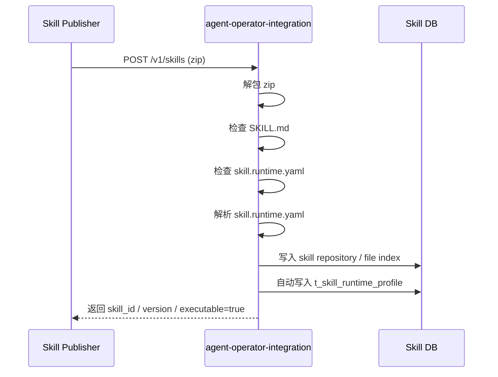

# Skill Runtime YAML 设计

## 文档范围

本文档只讲目标设计，不描述当前最小实现细节。

本文解决的问题：

1. `SKILL.md` 中包含示例命令时，平台如何避免把自然语言命令当成执行真源
2. `skill.runtime.yaml` 应该承担什么职责
3. 注册时如何自动解析并落库
4. 外部 Agent 如何在不写 runtime profile 的前提下直接使用可执行 Skill

当前实现状态见：

- [skill_runtime_profile_execution_minimal.md](/Users/chenshu/Code/github.com/kweaver-ai/adp/execution-factory/operator-integration/docs/design/features/skill_runtime_profile_execution_minimal.md)

## 1. 核心结论

### 1.1 单一执行真源

在执行工厂架构里：

- `SKILL.md` 不是执行真源
- `skill.runtime.yaml` 才是执行真源

### 1.2 模型与 runtime 职责分离

- `SKILL.md`
  - 面向模型
  - 负责场景判断、输入输出语义、约束说明、示例命令
- `skill.runtime.yaml`
  - 面向 runtime
  - 负责 entrypoint、command template、runtime_type、输入输出 schema

### 1.3 Agent 不负责写 Runtime Profile

推荐职责边界：

- Skill 作者提供 `SKILL.md` 和 `skill.runtime.yaml`
- AOI 注册时自动解析并写入 runtime profile
- 外部 Agent 只读取 Skill 并调用 execute

## 2. 为什么不能直接执行 `SKILL.md` 里的命令

很多 skill 会写出类似内容：

````md
你可以使用：

```bash
python3 scripts/image_to_pdf.py --file-path xxx --outpath xxx
```

````

在本地 agent 模式下，这种写法通常可直接用，因为：

- 模型与 shell 在同一个本地环境中
- skill 目录已在本地存在
- 相对路径天然成立

但当前执行工厂架构不同：

- 外部 Agent 通过 HTTP 调用 AOI
- AOI 再通过 HTTP 调用 sandbox
- sandbox 里有 session、workspace、package materialize、task workspace prepare
- 输入输出路径必须由平台映射

因此不能把自然语言中的命令直接当成平台执行协议。

## 3. 推荐职责划分

### 3.1 `SKILL.md`

推荐保留：

- 场景描述
- 什么时候用
- 什么时候不要用
- 输入输出语义
- 示例命令
- 能力名说明

推荐不要承担：

- 机器可解析的 command template 真源
- sandbox 内路径规范
- 真实 entrypoint 配置

### 3.2 `skill.runtime.yaml`

推荐承担：

- `entrypoint` 定义
- `command` 模板
- `runtime_type`
- `inputs`
- `outputs`

它是唯一机器可解析的执行真源。

## 4. 推荐文件布局

对于 zip skill，推荐：

```text
skill.zip
├── SKILL.md
├── skill.runtime.yaml
├── references/
└── scripts/
```

`SKILL.md` 和 `skill.runtime.yaml` 应位于 zip 根目录同级。

## 5. 推荐格式

```yaml
version: 1

entrypoints:
  - name: to_pdf
    description: Convert a source file into a PDF document
    runtime_type: python
    command:
      - python3
      - scripts/to_pdf.py
      - --file-path
      - "{{input_file}}"
      - --outpath
      - "{{output_path}}"
    inputs:
      input_file:
        type: file
        required: true
        description: Source file to convert
      mode:
        type: text
        default: fast
        enum: [fast, safe]
        description: Conversion mode
    outputs:
      output_path:
        type: file
        description: Generated PDF file path
```

### 字段说明

- `version`
  - YAML 协议版本
- `entrypoints`
  - 一个 skill 可暴露多个 entrypoint
- `entrypoints[].name`
  - 对外稳定能力名，例如 `to_pdf`
- `entrypoints[].description`
  - 能力描述
- `entrypoints[].runtime_type`
  - 运行时类型，例如 `python`
- `entrypoints[].command`
  - 真正执行的命令模板，脚本路径统一相对于 package root 描述
- `entrypoints[].inputs`
  - 输入声明
- `entrypoints[].outputs`
  - 输出声明

推荐的最小输入字段：

- `type`
- `required`
- `default`
- `enum`
- `description`

命令路径规则：

- `command[0]` 当前只允许白名单运行器：`python`、`python3`、`bash`、`sh`、`node`、`nodejs`
- 允许写包根相对路径，例如 `scripts/to_pdf.py`
- 不允许写死 sandbox 绝对路径，例如 `/workspace/...`、`/runtime/...`、`.tasks/...`
- 对于脚本类路径（如 `.py`、`.sh`、`.js`、`.ts`），注册时会校验该路径在 zip 包内真实存在

## 6. 注册时的目标流程

### 6.1 zip 中包含 `skill.runtime.yaml`

这是推荐路径。



目标行为：

- 自动发现 `skill.runtime.yaml`
- 自动解析并校验
- 自动写入 runtime profile
- 外部 Agent 不需要再单独写 profile

### 6.2 zip 中不包含 `skill.runtime.yaml`

默认按普通 resource skill 处理：

- 正常注册
- 可渐进式读取
- 不自动生成 runtime profile
- 不可直接执行脚本

## 7. “可运行 Skill 但未带 YAML”的补全策略

如果业务上要求“这是可运行技能”，但 zip 中没有 `skill.runtime.yaml`，建议这样处理：

### 7.1 系统生成候选稿

可基于以下信息生成候选 `skill.runtime.yaml`：

- `SKILL.md`
- 文件树
- 脚本文件名
- 示例模板

### 7.2 必须确认后落库

候选稿不能直接上线，必须：

- 由发布者确认
- 或由平台管理面补全

结论：

- 允许自动生成候选稿
- 不允许平台“猜测后直接生效”

## 8. 如何避免误导模型

### 8.1 问题

如果模型同时直接消费：

- `SKILL.md` 里的示例命令
- `skill.runtime.yaml` 里的真实 command template

会出现双重语义源。

### 8.2 解决方案

模型不直接消费 `skill.runtime.yaml`，而是消费由平台派生出的能力摘要。

例如：

```json
{
  "runtime_capabilities": [
    {
      "name": "to_pdf",
      "description": "Convert a source file into a PDF document"
    }
  ]
}
```

模型看到的是：

- `SKILL.md`
- `runtime_capabilities`

模型看不到：

- 真实 command template
- 具体脚本相对路径
- sandbox 路径映射规则

## 9. 对外目标体验

外部 Agent 的理想使用方式应收敛成：

1. `GET /skills/:skill_id/content`
2. `POST /skills/:skill_id/files/read`
3. 读取 `runtime_capabilities`
4. 直接调用 execute

也就是：

- Agent 不写 runtime profile
- Agent 不解析 YAML
- Agent 不拼底层命令
- Agent 只选择能力名，例如 `to_pdf`

## 10. 与当前实现的关系

当前代码还没有实现：

- 注册时自动解析 `skill.runtime.yaml`
- 自动写入 runtime profile
- `/content` 返回 `runtime_capabilities`

但这三项是下一阶段最直接的落地方向。
